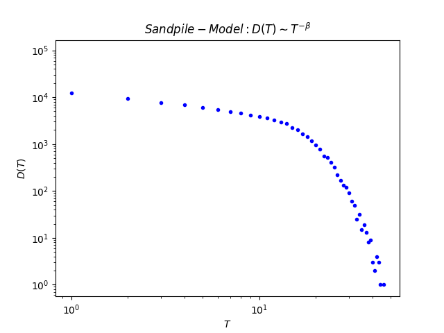

<!--MathJax-->

<!--Head-->
<head>
  <title></title>
</head>

<!--Title-->

    

    
        <b>Sandpile-Model</b>
    
    

<!--Version-->

    
        

        <b>zhangtao</b>
        

        

        <b>ztao1991@gmail.com</b>
        

        

        <b>2017/04/04</b>
        

    

<!--Markdown-->

# 沙堆模型
# 实验步骤
# 实验规模
\\( L^2 = 10 \cdot 10;N = 1000000 \\)

# 源代码
## 模拟计算（C++）
[模拟并记录沙堆的高度](https://github.com/ztao1991/Networks/blob/master/Exercise/Net2_ex1/sandpile-model-N.cpp)

[模拟并记录雪崩的规模和时间](https://github.com/ztao1991/Networks/blob/master/Exercise/Net2_ex1/sandpile-model.cpp)

## 原始数据（Txt）
[沙粒的高度](https://github.com/ztao1991/Networks/blob/master/Exercise/Net2_ex1/sandpile-model_N.txt)

[雪崩的规模](https://github.com/ztao1991/Networks/blob/master/Exercise/Net2_ex1/sandpile-model_S.txt)

[雪崩的时间](https://github.com/ztao1991/Networks/blob/master/Exercise/Net2_ex1/sandpile-model_T.txt)

## 数据处理（Python）
[plot_sandpile_model_N.py](https://github.com/ztao1991/Networks/blob/master/Exercise/Net2_ex1/plot_sandpile_model_N.py)

[plot_sandpile_model_TS.py](https://github.com/ztao1991/Networks/blob/master/Exercise/Net2_ex1/plot_sandpile_model_TS.py)

# 输出
<!---->

    
    

    
        <b></b>
    
    

    
    

    
        <b></b>
    
    

    
    

    
        <b></b>
    
    

# 小结

<!--Markdown-->
